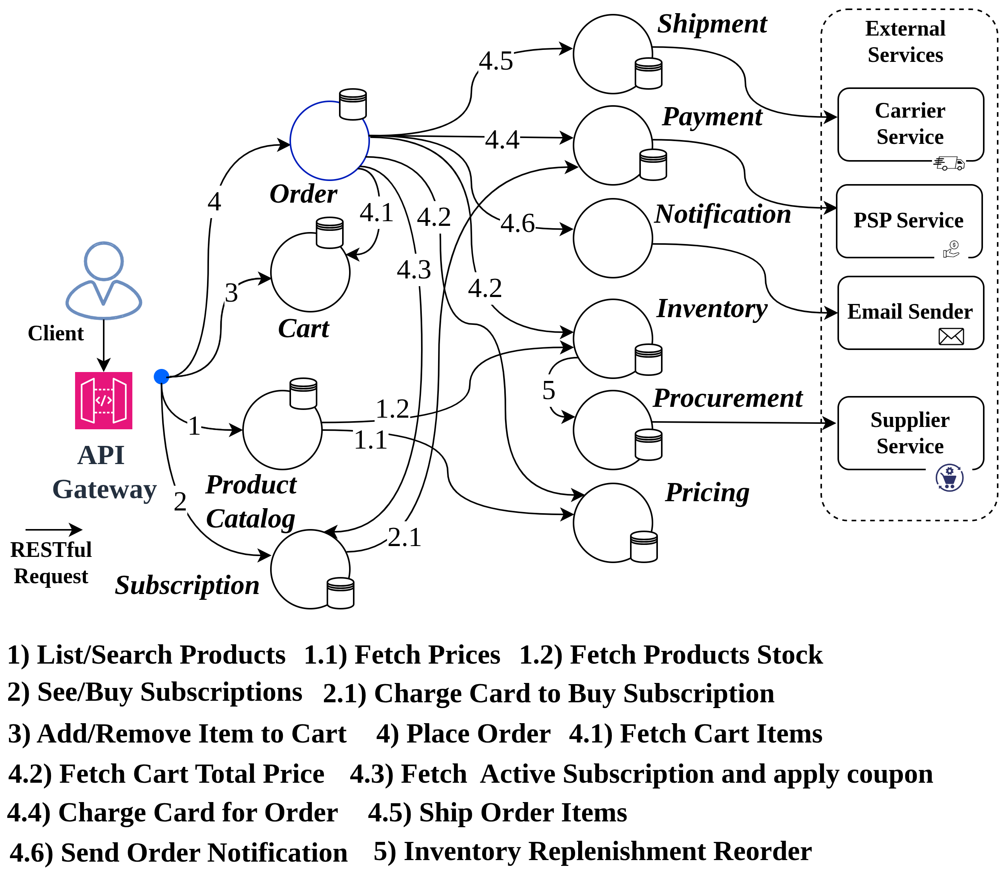

# RetailBen

## A Microservice System Benchmark for Retail Supply Chain Management:

### Core Services:
1. **Inventory Service**: Manages product inventory levels, stock updates, and availability.
2. **Order Service**: Handles checkout workflow including customer orders, order processing, and order status tracking.
3. **Payment Service**: Manages payment processing, transactions, and refunds.
4. **Shipping Service**: Oversees shipping logistics, tracking, and delivery status.
5. **Procurement Service**: Inventory replenishment by reordering products from suppliers based on demand and stock levels.
6. **Product Search Service**: Provides search functionality for products, including filtering and sorting options.
7. **Pricing Service**: Provides dynamic pricing based on demand, coupons, and competitor pricing.
8. **Shopping Cart Service**: Maintains the shopping cart for customers, allowing them to add, remove, and view items before checkout.
9. **Notification Service**: Informs customers about order status, promotions, and other relevant updates via email external mock serivce.
10. 9. **Subscription Service**: View promotion code subscriptions, buy them, and retrieve current active subscription promo codes for cart and order services.

### Implementation:
All microservices are implemented using FastAPI, with RESTful APIs for synchronous communication via decentralized choreography.
The system uses NoSQL databases (e.g., MongoDB).

### Resiliency Patterns:
1. **Circuit Breaker**: To prevent cascading failures when a service is down or experiencing
2. **Retry Mechanism**: To handle transient failures by retrying failed requests with exponential backoff.
3. **Bulkhead Isolation**: To isolate critical services and prevent resource exhaustion.
4. **Fallback Mechanism**: To provide default responses or alternative services when a primary service
5. **Load Balancing**: To distribute incoming requests across multiple instances of a service for improved performance and reliability.
6. **Health Checks**: To monitor the health of services and automatically remove unhealthy instances from
7. **Distributed Tracing**: To track requests across multiple services for better observability and debugging.
8. **Service Discovery**: To enable services to find and communicate with each other dynamically without hardcoding service locations.
